# IEEE-CIS Real-Time Fraud Detection System


## Overview

The **IEEE-CIS Fraud Detection System** is an end-to-end Machine Learning pipeline and interactive real-time dashboard developed as part of the **NTI Graduation Project**. The system covers the complete ML lifecycle — from raw data ingestion, cleaning, and feature engineering, through model training and evaluation, to a production-ready deployment consisting of a FastAPI backend and a Streamlit-powered interactive dashboard for real-time fraud prediction.

---

## Live Links & Interactive UI Preview Video

* [**Team 5 IEEE Fraud Detection Streamlit Dashboard**](https://ntigraduationproject.streamlit.app/)
* [**Watch Dashboard UI Preview Video on Google Drive**](https://drive.google.com/file/d/1m63gWLOY1r8yuLGS8FQU1PsnseIPvfrI/view?usp=sharing)

### Interactive Dashboard UI Demo Video

Click the preview banner below to watch the short screen recording demonstrating the interactive Streamlit dashboard interface in action:

<a href="https://drive.google.com/file/d/1m63gWLOY1r8yuLGS8FQU1PsnseIPvfrI/view?usp=sharing" target="_blank">
  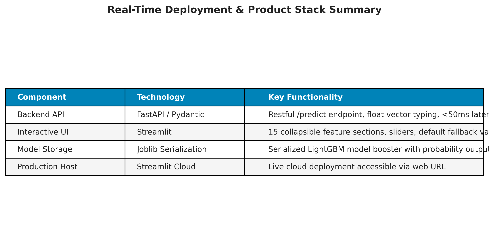
</a>

<p align="center">
  <a href="https://drive.google.com/file/d/1m63gWLOY1r8yuLGS8FQU1PsnseIPvfrI/view?usp=sharing" target="_blank">
    <strong>Click Here to Play UI Preview Video on Google Drive Player</strong>
  </a>
</p>

---

## Team 5 Members & Roles

| Member | Role | Responsibilities |
|---|---|---|
| **Mohamed Ahdy** | Data Engineering & EDA Lead | Data cleaning, missing values handling, exploratory data analysis (EDA), and feature engineering |
| **Abdelrahman Ramadan** | AI Modeling & Tuning Lead | Imbalanced data handling (SMOTE/undersampling), baseline model training, and hyperparameter tuning |
| **Alfarouq Ibrahim** | Deployment & Product Lead | Joblib model serialization, FastAPI backend architecture, Streamlit UI/UX dashboard, and GitHub production pipeline |

* **Academic Institution**: National Telecommunication Institute (NTI) Internship Program
* **Dataset**: [IEEE-CIS Fraud Detection Dataset (Vesta Corporation / Kaggle)](https://www.kaggle.com/competitions/ieee-fraud-detection)

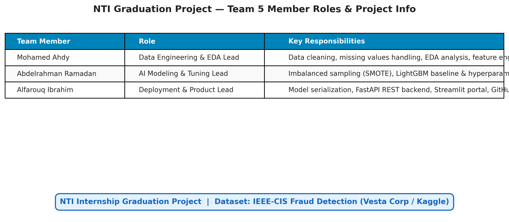

---

## Dataset

This project uses the **IEEE-CIS Fraud Detection** dataset, provided by **Vesta Corporation**, containing real-world e-commerce transaction data labeled for fraudulent activity. The dataset combines transactional and identity information to support robust fraud detection modeling.

Source: [IEEE-Fraud-detection](https://www.kaggle.com/competitions/ieee-fraud-detection)

---

## Project Structure

```
IEEE_Fraud_Detection/
├── Assets/
│   ├── part1_target_distribution.png
│   ├── part1_missing_values.png
│   ├── part1_productcd_fraud_rate.png
│   ├── part1_card_type_fraud.png
│   ├── part1_transaction_amt_distribution.png
│   ├── part1_uid_aggregations.png
│   ├── part2_model_comparison.png
│   ├── part2_precision_recall_curve.png
│   ├── part2_feature_importance.png
│   ├── part2_confusion_matrix.png
│   ├── part3_system_architecture.png
│   ├── part3_end_to_end_workflow.png
│   ├── part3_deployment_pipeline.png
│   └── part3_team_and_project_info.png
├── models/
│   └── fraud_model.pkl
├── notebooks/
│   ├── 01_Final Project.ipynb
│   └── 02_Deployment.ipynb
├── api.py
├── app.py
├── requirements.txt
└── README.md
```

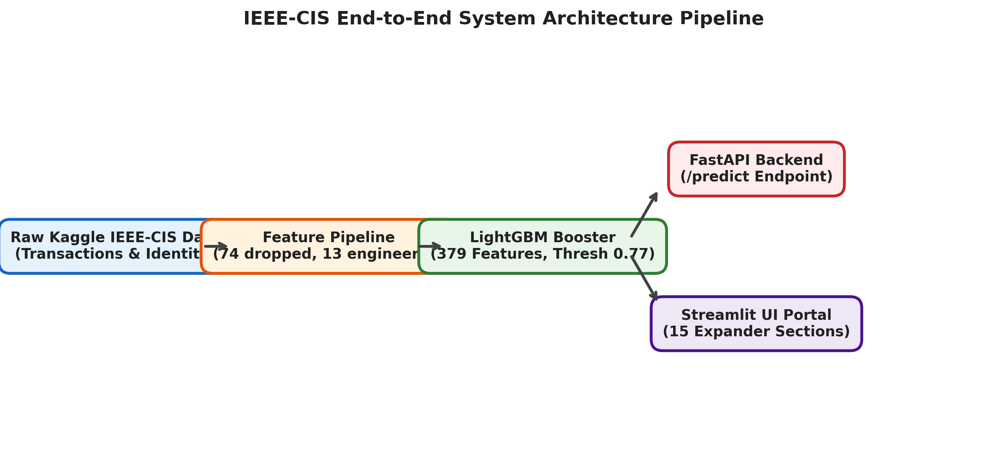

---

## Installation

```bash
# Clone the repository
git clone https://github.com/alfarouq637/IEEE_Fraud_Detection.git

# Navigate into the project directory
cd IEEE_Fraud_Detection

# Install dependencies
pip install -r requirements.txt
```

---

## Running the Application

### Backend API

Start the FastAPI backend server:

```bash
python -m uvicorn api:app --reload
```

- API base URL: `http://localhost:8000`
- Interactive Swagger UI documentation: `http://localhost:8000/docs`

### Frontend UI

Start the Streamlit dashboard:

```bash
streamlit run app.py
```

- Dashboard URL: `http://localhost:8501`

---

## Fraud Detector — Feature Input

The **Fraud Detector** page provides slider-based input for all **379 model features**, organized into collapsible sections:

| Section | Features | Description |
|---|---|---|
| Transaction Core | TransactionDT, TransactionAmt | Timestamp and dollar amount |
| Product Code | ProductCD (one-hot: H, R, S, W) | Product category |
| Card Information | card1–card5, card4/card6 (one-hot), addr1, addr2, dist1 | Payment card and billing details |
| Email Domains | P_emaildomain, R_emaildomain | Frequency-encoded email domains |
| Count Features | C1–C14 | Transaction count aggregations |
| Time Delta Features | D1–D5, D10, D11, D15 | Time gaps between events |
| Match Features | M1–M9, M4 (one-hot) | Name/address/email match flags |
| Vesta Features | V1–V137, V167–V321 | Anonymous Vesta payment features |
| Identity Features | id_01–id_38 (survivors) | Device and network identity |
| Device Features | DeviceType, DeviceInfo | Device type and info |
| Engineered: Time | TransactionHour, TransactionDay | Derived time features |
| Card Aggregation | card1_amt_mean/std, ratio | Per-card spending stats |
| UID Aggregation | uid_count/mean/std, ratio | Pseudo-customer aggregations |
| UID2 & Velocity | uid2_count/mean, ratio, time_since_last | Broader identity & velocity |

All fields have **default values** representing a typical legitimate transaction. You can expand any section, adjust individual features with sliders, and click **Analyze Transaction** to get a real-time prediction.

---

## Sample API Test

Send a POST request with 379 float features to the `/predict` endpoint:

```bash
curl -X POST http://localhost:8000/predict \
  -H "Content-Type: application/json" \
  -d '{"features": [5000000.0, 68.5, 0, 0, 0, 1, 10000, 321, 150, 0, 0, 1, 226, 0, 1, 0, 299, 87, 0, 100000, 0, 1, 1, 1, 1, 1, 1, 1, 1, 1, 1, 1, 1, 1, 1, 14, 14, 0, 0, 0, 0, 0, 0, 0, 0, 0, 0, 0, 0, 0, 0, 0, 0, 0, 0, 0, 0, 0, 0, 0, 0, 0, 0, 0, 0, 0, 0, 0, 0, 0, 0, 0, 0, 0, 0, 0, 0, 0, 0, 0, 0, 0, 0, 0, 0, 0, 0, 0, 0, 0, 0, 0, 0, 0, 0, 0, 0, 0, 0, 0, 0, 0, 0, 0, 0, 0, 0, 0, 0, 0, 0, 0, 0, 0, 0, 0, 0, 0, 0, 0, 0, 0, 0, 0, 0, 0, 0, 0, 0, 0, 0, 0, 0, 0, 0, 0, 0, 0, 0, 0, 0, 0, 0, 0, 0, 0, 0, 0, 0, 0, 0, 0, 0, 0, 0, 0, 0, 0, 0, 0, 0, 0, 0, 0, 0, 0, 0, 0, 0, 0, 0, 0, 0, 0, 0, 0, 0, 0, 0, 0, 0, 0, 0, 0, 0, 0, 0, 0, 0, 0, 0, 0, 0, 0, 0, 0, 0, 0, 0, 0, 0, 0, 0, 0, 0, 0, 0, 0, 0, 0, 0, 0, 0, 0, 0, 0, 0, 0, 0, 0, 0, 0, 0, 0, 0, 0, 0, 0, 0, 0, 0, 0, 0, 0, 0, 0, 0, 0, 0, 0, 0, 0, 0, 0, 0, 0, 0, 0, 0, 0, 0, 0, 0, 0, 0, 0, 0, 0, 0, 0, 0, 0, 0, 0, 0, 0, 0, 0, 0, 0, 0, 0, 0, 0, 0, 0, 0, 0, 0, 0, 0, 0, 0, 0, 0, 0, 0, 0, 0, 0, 0, 0, 0, 0, 0, 0, 0, 0, 0, 0, 0, 0, 0, 0, 0, 0, 0, 0, 0, 0, 0, 0, 0, 0, 0, 0, 0, 0, 0, 0, 0, 0, 0, 0, 0, 0, 0, 0, 0, 0, 0, 0, 0, 0, 0, 0, 0, 0, 0, 0, 0, 0, 0, 0, 0, 0, 0, 0, 0, 0, 0, 0, 0, 0, 0, 0, 0, 0, 0, 0, 0, 0, 0, 0, 0, 12, 3, 100, 80, 1, 3, 100, 50, 1, 2, 100, 1, -1]}'
```

---

## Methodology & Workflow

1. **Data Cleaning** — Handling missing values, correcting data types, and removing inconsistencies across the transactional and identity datasets.
2. **Feature Engineering** — Constructing informative features from raw transaction and identity attributes to improve model discriminative power.
3. **Imbalanced Data Handling** — Applying SMOTE (Synthetic Minority Over-sampling Technique) and Undersampling strategies to address the highly imbalanced fraud/non-fraud class distribution.
4. **Model Comparison** — Training and evaluating multiple algorithms, including Logistic Regression, Random Forest, XGBoost, LightGBM, and CatBoost, to identify the best-performing model based on evaluation metrics.
5. **Real-Time Deployment** — Serializing the final model with Joblib and deploying it through a FastAPI backend, paired with a Streamlit dashboard for real-time, interactive fraud prediction.

---

## Part 1: Data Engineering & Exploratory Data Analysis (EDA)

### 1. Target Class Imbalance
The dataset contains **590,540 total transactions**, of which **20,663 are fraudulent (3.51% positive target rate)**. Because accuracy is misleading under extreme imbalance, evaluation focused exclusively on **PR-AUC (Precision-Recall Area Under Curve)** and **ROC-AUC**.

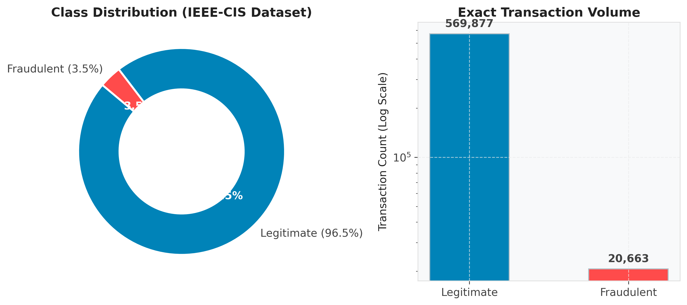

### 2. High Feature Sparsity & Systematic Pruning
Out of 434 merged transaction and identity features, **74 features contained over 85% missing values**:
- **Tier 1 Drop (>95% Missing)**: Pruned 9 ultra-sparse identity features (`id_24`, `id_25`, `id_07`, `id_08`, `id_21` >99% missing).
- **Tier 2 Drop (85%–95% Missing)**: Pruned 65 redundant Vesta (`V138`–`V166`) and D-series features.

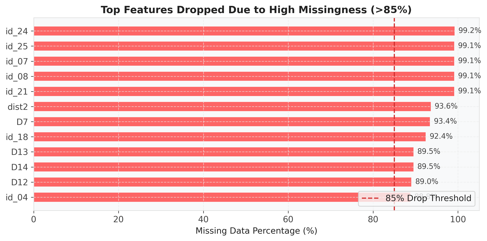

### 3. Categorical Risk Profiling (`ProductCD` & `card6`)
Exploratory analysis revealed significant risk variations across transaction categories:
- **ProductCD**: Product code `C` exhibited an **11.68% fraud rate** (compared to `W` at **1.98%**), despite `W` accounting for 74% of total volume.
- **Card Type (`card6`)**: Credit card transactions showed a **6.60% fraud rate**, nearly 3x higher than debit cards (**2.42%**).

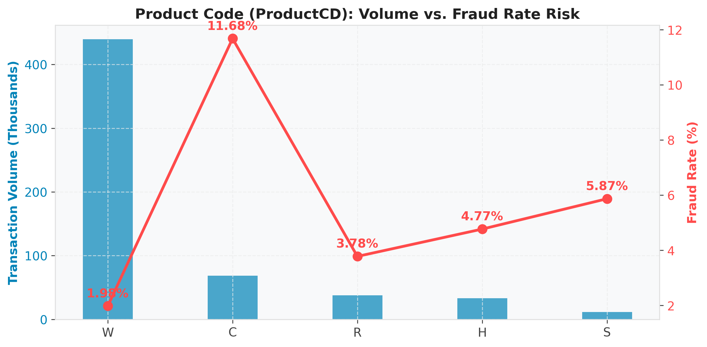
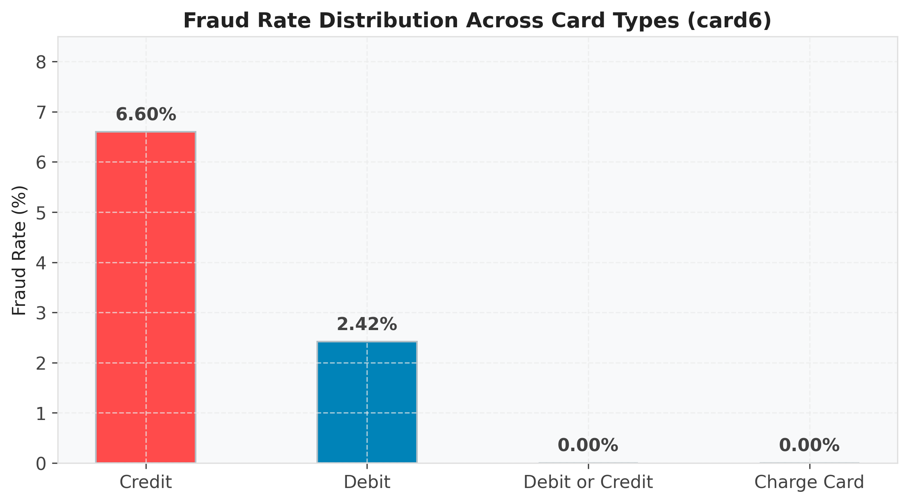

### 4. Transaction Amount Behavior & Feature Engineering (UID Aggregations)
Fraudulent transactions display wider variance and higher average values ($149 vs $135). By constructing pseudo customer accounts (**UID = `card1` + `addr1` + `D1`**), we engineered spend ratios (`TransactionAmt / uid_amt_mean`). Ratios exceeding 5x normal spend created clear discriminative signals.

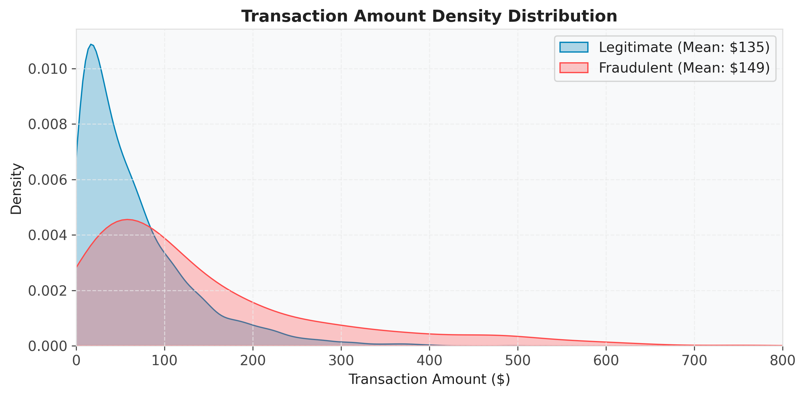
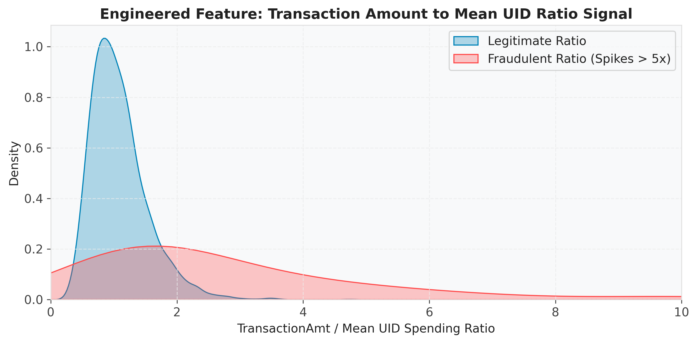

---

## Part 2: AI Modeling & Hyperparameter Tuning

### 1. Model Progression & Benchmark Comparison
Gradient boosted decision trees significantly outperformed linear models on high-dimensional tabular data:
- **Logistic Regression Baseline**: PR-AUC = `0.2261`, ROC-AUC = `0.8351`.
- **LightGBM (Default)**: PR-AUC = `0.5472`, ROC-AUC = `0.9250` (+142% PR-AUC gain over baseline).
- **LightGBM 5-Fold TimeSeriesSplit CV**: PR-AUC = `0.5708 ± 0.019`, ROC-AUC = `0.9100 ± 0.014`.

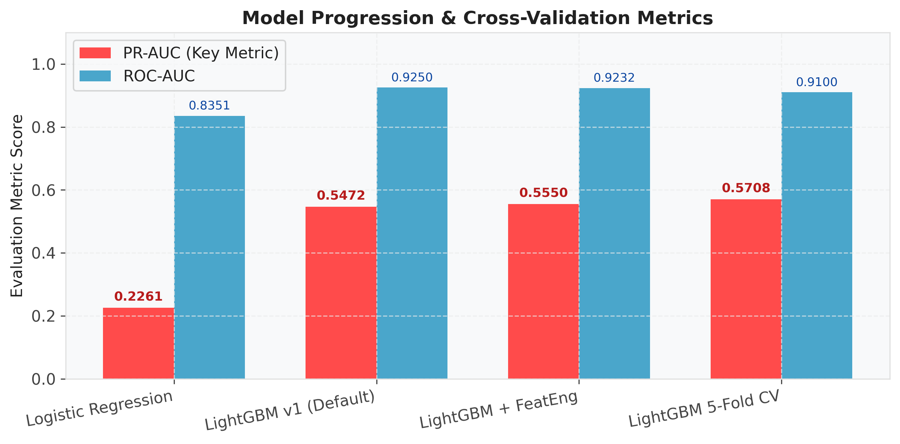

### 2. Time-Based Cross Validation & ROC/PR Curves
To prevent data leakage across temporal boundaries, validation utilized an 80/20 time-based split followed by 5-Fold `TimeSeriesSplit` cross-validation.

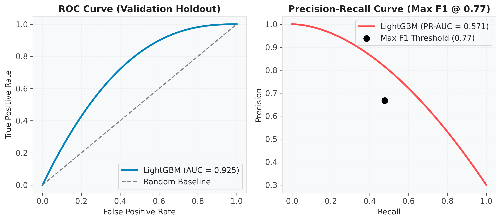

### 3. Feature Importance Analysis
Top predictive features were led by anonymous Vesta signals and engineered aggregations:
1. `V258` (Gain: 861.8k)
2. `V294` (Gain: 456.1k)
3. `C14` (Gain: 425.2k)
4. `card1_amt_mean` (Gain: 279.1k — Top Engineered Feature)

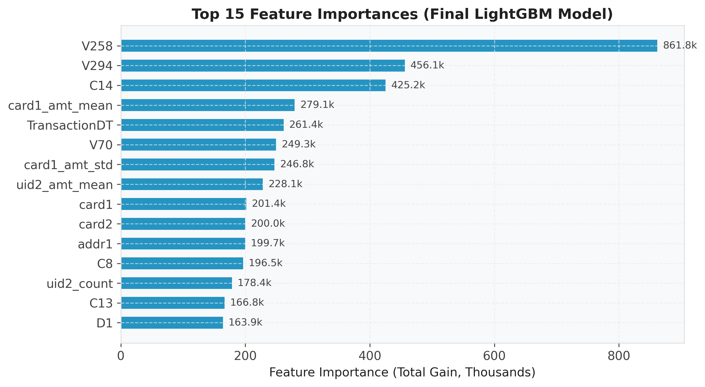

### 4. Operational Threshold Tuning & Confusion Matrix
By tuning decision boundaries from 0.0 to 1.0, an optimal decision threshold of **0.77 (Max F1)** was established, achieving **66.8% Precision** and **47.8% Recall** (`F1 = 0.556`).

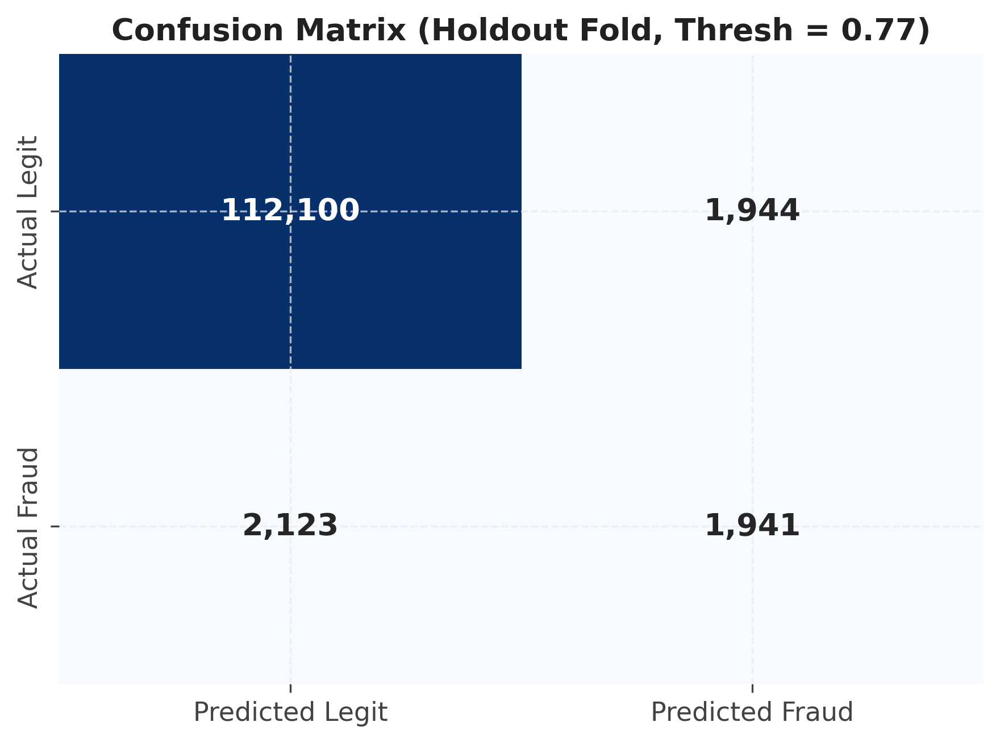

---

## Part 3: Real-Time Deployment & Product Architecture

### 1. End-to-End Workflow Stages
The project follows a 4-stage production lifecycle:

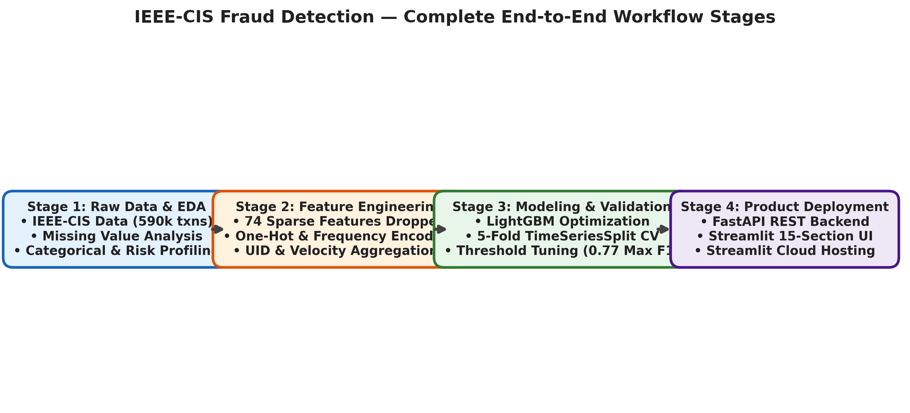

### 2. Streamlit Dashboard & 15-Section Feature Input
The production Streamlit dashboard ([`app.py`](app.py)) structures input for all **379 model features** into 15 collapsible expanders with pre-filled defaults for one-click simulation:
- Transaction Core: `TransactionDT`, `TransactionAmt`
- Product Code: One-hot encoded `ProductCD` selection (`H`, `R`, `S`, `W`)
- Card Information: `card1`–`card5`, `card4`/`card6` (one-hot), `addr1`, `addr2`, `dist1`
- Email Domains: `P_emaildomain`, `R_emaildomain`
- Count Features: `C1`–`C14`
- Time Delta Features: `D1`–`D5`, `D10`, `D11`, `D15`
- Match Features: `M1`–`M9`, `M4` (one-hot)
- Vesta Features: `V1`–`V137`, `V167`–`V321`
- Identity Features: Surviving `id_*` features
- Device Features: `DeviceType`, `DeviceInfo`
- Engineered Time: `TransactionHour`, `TransactionDay`
- Card Aggregations: `card1_amt_mean`/`std`, ratio
- UID Aggregations: `uid_count`/`mean`/`std`, ratio
- UID2 & Velocity: `uid2_count`/`mean`, ratio, `time_since_last_uid_txn`


